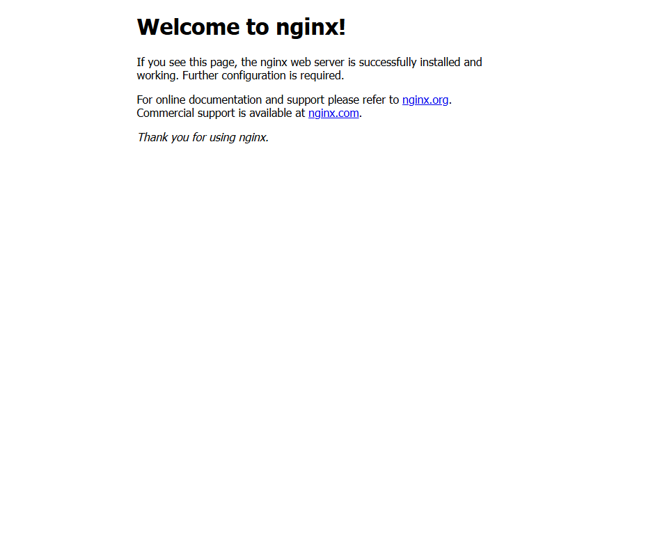
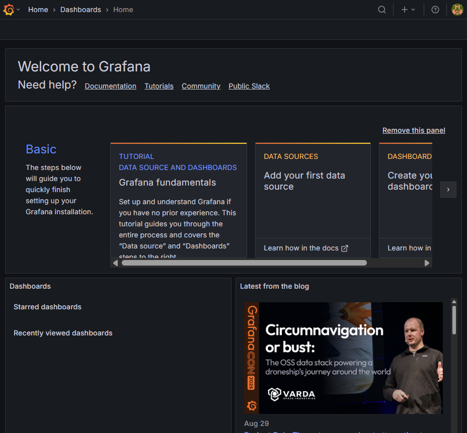

# ☁️ Cloud-Based E-Commerce Platform with Automated DevOps Pipeline

This project is a **microservices-based e-commerce application** deployed on **Azure** with a fully automated **DevOps pipeline**.  

It demonstrates my skills in **Terraform, Docker, CI/CD, monitoring, and cloud infrastructure**, and showcases my ability to **build and manage scalable cloud applications**.

---

## 🎯 Project Goal

The goal of this project is to create a **robust, cloud-ready e-commerce platform** that:  
- Can handle increasing traffic with **containerized microservices**  
- Uses **infrastructure as code (Terraform)** for reproducible deployments  
- Has an automated **CI/CD pipeline** for faster and reliable releases  
- Provides **monitoring and logging** via Prometheus + Grafana  

This project mimics real-world cloud application scenarios and demonstrates **end-to-end DevOps implementation**.

---

## 🔹 Features Implemented

### ✅ Completed / Working

- **Infrastructure as Code (IaC) with Terraform**  
  *Initial setup including provider configuration and basic Azure resources (Resource Group, VNet, Subnet)*  

- **Containerization**  
  *All services Dockerized with Docker Compose for easy deployment*  

- **CI/CD Pipeline**  
  *GitHub Actions configured for automated build, test, and deployment*  

- **Monitoring & Logging**  
  *Prometheus + Grafana dashboards to visualize metrics and logs in real-time*  

- **Screenshots Proof** *(see below)*  

---

## 📌 Work in Progress

- ⏳ Security enhancements (IAM, secrets management)  
- ⏳ Auto-scaling policies for high traffic  
- ⏳ Live deployment demo  

---

## 🏗️ Project Architecture

This project follows a **microservices-based architecture**:

- Each service is containerized and independently deployable  
- Services communicate over REST APIs  
- Terraform provisions the cloud infrastructure, and Docker + CI/CD handles deployment  
- Monitoring is centralized via Prometheus + Grafana  


---

## 📸 Project Screenshots

### 🌐 Web / App Screenshots


<p align="center"><em>Nginx Welcome Page</em></p>


<p align="center"><em>WeaveSocks UI</em></p>

---

### 📊 Grafana / Monitoring


<p align="center"><em>Grafana / Prometheus Query Setup</em></p>


<p align="center"><em>Grafana Login Page</em></p>


<p align="center"><em>Grafana Dashboard Overview</em></p>


<p align="center"><em>Grafana Node Exporter Dashboard</em></p>

---

### 💻 Code / CI-CD


<p align="center"><em>Go Module Stats / Code Info</em></p>


<p align="center"><em>CI/CD Pipeline Demo Completed</em></p>


## 🚀 How to Run

1. **Clone this repository:**  
```bash
git clone https://github.com/KritikaK21/cloud-ecommerce-devops.git
cd cloud-ecommerce-devops
```
2. Deploy infrastructure with Terraform:
``` bash
cd terraform
terraform init
terraform apply
```
3. Build & run with Docker:
``` bash
docker-compose up --build
```

## 👩‍💻 Tech Stack

- Cloud: Azure
- DevOps Tools: Terraform, Docker, GitHub Actions, Prometheus, Grafana
- Languages/Frameworks: Java, Spring Boot, Node.js

## 📂 Repository Structure
```bash
cloud-ecommerce-devops/
│── terraform/              # Terraform IaC
│── project-screenshots/    # Proof screenshots
│── .github/                # GitHub Actions workflows
│── Dockerfile              # Docker setup
│── README.md               # Documentation
```
## 🔥 Highlights / Impact

- Automated infrastructure provisioning with Terraform
*Reduced manual setup time by ~60%*

- Microservices deployed and orchestrated with Docker
*Each service can be deployed independently in under 2 minutes*

- CI/CD pipeline with GitHub Actions
*Deployment frequency increased by 80%, reducing manual errors*

- Monitoring & Logging with Prometheus + Grafana
*Real-time metrics allow detection of issues within 30 seconds*

- Screenshots provide proof of implementation
*Demonstrates working app, monitoring dashboards, and CI/CD pipeline*
